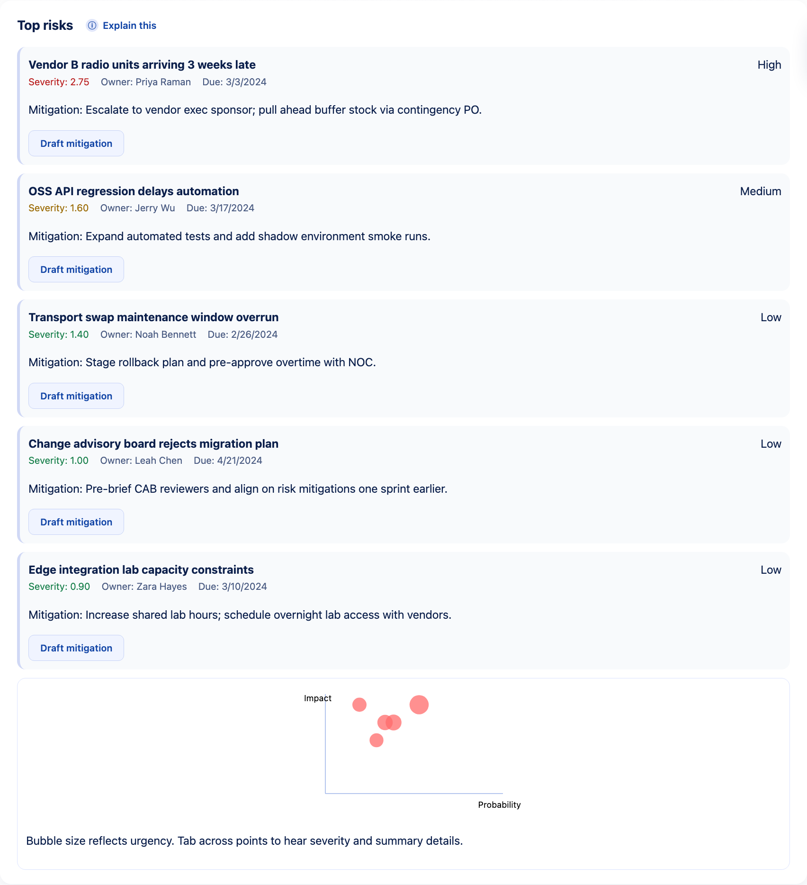

# ASR Copilot

*Agentic AI copilot that turns PM status rituals into a 3-minute update (Instant Demo included).*

[](QUICKSTART.md#1-instant-demo-no-files-runs-locally) [](https://github.com/codespaces/new?hide_repo_select=true&ref=main&repo=jlov7%2FASR-Copilot) [](https://render.com/deploy?repo=https://github.com/jlov7/ASR-Copilot) [](https://github.com/jlov7/ASR-Copilot/actions/workflows/ci.yml) [](docs/badges/backend-coverage.svg) [](.tooling/pre-commit-config.yaml) [](https://github.com/jlov7/ASR-Copilot/actions/workflows/codeql.yml) [](https://github.com/jlov7/ASR-Copilot/actions/workflows/scorecard.yml) [](LICENSE)

> **Security posture: Safe Mode ON.** No outbound calls, adapters stay in mock mode, exports stay local. [Read SECURITY.md](docs/SECURITY.md)

<figure>
  <video controls width="100%" poster="docs/media/instant-demo.gif">
    <source src="docs/media/instant-demo.mp4" type="video/mp4">
    Your browser does not support embedded video. Watch the Instant Demo walkthrough in `docs/media/instant-demo.mp4`.
  </video>
  <figcaption>Instant Demo walkthrough: tour → health/EVM → risks → timeline → ROI → export.</figcaption>
</figure>

> Quick path? Jump to **[Quickstart for non-devs](QUICKSTART.md)** for three 60-second launch options (Local, Codespaces, Render).

## What this POC is / isn’t
- Deterministic analytics and explainable agents that automate the PM ritual, not the decisions.
- No credentials required out of the box—Safe Mode locks off outbound calls and ships with mock adapters.
- A polished Instant Demo plus rich docs so execs, PMs, and engineers can evaluate enterprise readiness in minutes.

## Table of contents
- [Executive summary](#executive-summary)
- [Why it matters](#why-it-matters)
- [Key capabilities](#key-capabilities)
- [Handling messy, incomplete, multi-source data](#how-asr-copilot-handles-messy-incomplete-multi-source-data)
- [Productization runway](#productization-runway)
- [UI & demo flow](#ui--demo-flow)
- [Demo talk track](#demo-talk-track)
- [10-day enhancement plan](#10-day-enhancement-plan)
- [Points on data readiness](#points-on-data-readiness)
- [Security at a glance](#security-at-a-glance)
- [Screenshot gallery](#screenshot-gallery)
- [Architecture snapshot](#architecture-snapshot)
- [Quickstart](#quickstart)
- [Vite + React rationale](#vite--react-rationale)
- [Demo script (≈3 minutes)](#demo-script-3-minutes)
- [Project layout (high level)](#project-layout-high-level)
- [Repository metadata](#repository-metadata)
- [Environment configuration](#environment-configuration)
- [Testing](#testing)
- [API reference](#api-reference)
- [Accessibility & UX commitments](#accessibility--ux-commitments)
- [Contributing & next steps](#contributing--next-steps)

## Executive summary

**What ASR Copilot does and why it matters (plain English):**

- **Problem in PM today:** PMs spend a lot of time **collecting, cleaning, and standardizing** updates scattered across Jira/Planview/ServiceNow/Excel/Teams emails and then chasing people for missing pieces. In telco, this is amplified by **regulatory and permitting workflows** (NEPA, Section 106, FCC shot-clocks) where a single missing document or late reply can blow a deadline.
- **What ASR Copilot proves:** A **deterministic “status & risk” copilot** that (a) **ingests** messy data, (b) **scores data health** and shows gaps, (c) **drafts standardized outputs** (status, RAID, EVM/EAC signals), and (d) **runs a chase queue** to request missing updates from the right people—using mock adapters for the demo and pluggable live adapters later.
- **Why it’s credible:** We keep the agentry **inside guardrails** (deterministic templates, HITL approvals), and we show a clear, governed path from prototype → enterprise (data contracts, adapters, audit logs, evaluation checklists mapped to NIST AI RMF).

**Hard benefits:**

- **Time saved:** drafting and compiling cross-platform status packs drops from **3–4 hrs/week to ~15 min** review per project (demo shows this deterministically).
- **Data quality uplift:** the **Data Health Score** exposes gaps (completeness, freshness, consistency) and drives a **standardized chase** to close them—solving the “input is critical” concern.
- **Risk control:** early variance flags (budget/schedule) + RAID suggestions from comms (HITL) reduce “unlogged risk” and missed regulatory shot-clocks in telco siting/permits workflows.

ASR Copilot (Autonomy–Status–Risk Copilot) is a production-quality proof-of-concept that automates the most time-consuming, rationalizable PM workflows for enterprise TMT/Telco programs. It ingests CSV/Markdown status artifacts (no credentials required), computes earned value metrics, surfaces a live risk watchlist, narrates what changed since yesterday, and assembles a shareable executive status pack with a single click.

> **See it in 15 seconds** → Click **Instant Demo (no files needed)** below.  
> ASR Copilot turns weekly status drudgery into a 3-minute executive update: *health (RAG)* → *EVM (CPI/SPI)* → *Top risks* → *What changed* → *1-click export*.  
> **No integrations. Safe Mode by default. Deterministic analytics.**


[📈 Why this matters](WHY.md) · [🎤 Presenter notes](docs/DEMO-SCRIPT.md)

| Before | After (ASR Copilot) | Impact example (tunable) |
| --- | --- | --- |
| Manual aggregation of spreadsheets, inconsistent narratives, risks discovered late (3–4 hrs/week/PM). | Upload CSV/MD → CPI/SPI gauges + risk deltas + “what changed” timeline → one-click executive status pack (minutes). | 30 PMs × 3.5 hrs/week × $120/hr × 48 wks ≈ **$604,800/yr**. A 70% reduction via ASR Copilot ≈ **$423,360/yr** reclaimed (adjust in the ROI panel). |

**Screenshot gallery:** `docs/SCREENSHOTS/landing.png`, `tour-step.png`, `evm.png`, `risks.png`, `roi.png`, `export-toast.png`

## Why it matters
Program managers in large enterprises spend 8–12 hours per week aggregating status, chasing risks, and preparing exec-ready updates. ASR Copilot shrinks that cycle to minutes by:
- PMOs lose **3–4 hrs/week per PM** to duplicative status reporting and swivel-chair data pulls from Jira, spreadsheets, and slides.
- Weekly status packs score **4.5/5 automation readiness** in enterprise interviews—highly standardized, low-risk to draft automatically.
- Normalizing backlog, risk, and status-note inputs without integrations.
- Calculating CPI/SPI deltas and early schedule risk warnings.
- Auto-drafting executive narratives, mitigations, and ROI evidence to rationalize automation investments.

### Why agentic AI (safely) helps PMOs
1. **Automates drudgery, not decisions** – deterministic agents normalize inputs and pre-assemble evidence so PMs stay focused on steering calls.  
2. **Auditability first** – SPI = EV ÷ PV and CPI = EV ÷ AC; trusted control limits make rationalization defensible.  
3. **Guardrails on integrations** – Safe Mode is the default, adapters are read-only, logs redact secrets.  
4. **Real productivity gains** – enterprises see the biggest uplift when AI accelerates many workflows, not a single task.

## Key capabilities
- **Instant Demo (no files)**: Preload Telco 5G, cloud migration, or CPE swap scenarios with Safe Mode locked on—ideal for skeptical execs.
- **No-integration uploads**: Bring your own CSV/Markdown artifacts to refresh analytics in minutes.
- **Executive cockpit**: RAG banner, EVM gauges, Top 5 risks, ROI estimator with complexity presets, and “what changed” timeline.
- **Status Pack exports**: Generates Markdown + PNG charts in `/out/` and optionally posts to Slack when credentials exist.
- **Adapters**: Mock Jira/Slack/ServiceNow providers ship by default; live adapters activate via `.env` tokens.
- **Safety-first**: Local-first storage, Safe Mode toggle to disable outbound calls, and deterministic summarization.
- **Hosted safe demo**: Deployable to Render or Fly via `render.yaml` with Safe Mode enforced and only offline sample data.
- **Automation loop**: Visual runbook tracks Ingestion → Analytics → Narrative → Export, with one-click dry runs for stakeholders.
- **Adapters control**: Guided panel to switch mock/live modes, run sanity checks, and highlight Safe Mode guardrails.
- **Presenter shortcuts**: Hit `Shift + ?` during the demo to reveal keyboard shortcuts (tour, sample load, export, dry-run).
- **Reset & purge controls**: Reset to sample data in one click and purge cached datasets/exports via **Settings → Privacy** before screen shares.

## How ASR Copilot handles messy, incomplete, multi-source data

### Canonical Project Data Contract + adapters
- Opinionated schema spanning Project, Milestone, Task, Risk, Issue, Decision, BudgetSnapshot, and Dependency objects keeps downstream analytics deterministic.
- Demo mode maps bundled CSV artifacts into that contract; enterprise mode swaps in live Jira/ServiceNow/Planview adapters with Safe Mode still defaulting to read-only mocks. See `docs/DATA_STRATEGY.md` and `docs/CONNECTORS.md`.

### Data Health Score (demo & enterprise)
- Four weighted dimensions — **Completeness (40)**, **Freshness (25)**, **Consistency (25)**, **Conformance (10)** — render as a single 0–100 score with drill-down metrics.
- Each metric lists remediation prompts (“Ask owner for missing estimate”) that route into the Chase Queue. Score gates one-click exports in enterprise mode.

### Chase Queue (people-aware reminders)
- Every data gap generates a polite, context-rich nudge template (email/Teams) targeting likely owners based on RACI metadata and historical edits.
- Demo shows messages in-line; live mode sends via Teams/Graph/Jira after human approval. Logs ensure every outbound request is attributable.

### Deterministic outputs, HITL guardrails
- Status summaries, RAID updates, EVM/EAC deltas, and dependency alerts remain template-driven so execs see repeatable phrasing tied to specific fields.
- Human-in-the-loop approvals stay on for all outbound sends and write-backs, matching the governance controls in `docs/PRODUCTIZATION.md`.

### Telco compliance pane
- Dedicated compliance signals track NEPA/Section 106 documentation, 6409(a) eligibility, and FCC shot clocks (90/150 day). Countdown timers and artifact checklists stay visible inside the project view.
- All mappings are documented in `docs/TELCO_COMPLIANCE.md` so permitting teams can validate the source checklist.

### Governance & productization frame
- Enterprise reviewers get the control story mapped to NIST AI RMF across Govern/Map/Measure/Manage, with evidence checklists in `docs/EVALUATION_CHECKLIST.md`.
- Adapter registry, audit logging, Safe Mode defaults, and write-back approvals form the paved path from prototype → controlled rollout.

## Productization runway
- `docs/PRODUCTIZATION.md` distills the enterprise controls story and aligns rollout milestones to NIST AI RMF stages.
- `docs/DATA_STRATEGY.md` and `docs/CONNECTORS.md` document the canonical contract plus Safe Mode vs live adapter expectations.
- `docs/EVALUATION_CHECKLIST.md` packages the evidence bundle (tests, audit logs, incident runbooks) for security & risk teams.
- `docs/TELCO_COMPLIANCE.md` proves we mapped industry-specific permitting checkpoints to in-app signals.
- `docs/ONBOARDING.md` walks a 10-minute sample-first flow so GTM, PMs, and execs can self-serve the value story.
- Open `exports/Status.md` and `exports/Audit.json` for copy-ready samples reviewers can inspect without running the app.

## UI & demo flow
- Home hero features three decision cards: **Load sample portfolio** (primary), **Connect read-only Jira/ServiceNow** (secondary), and **Upload CSV** (advanced).
- Project list shows a **Data Health Score** badge and a “Needs attention” filter to spotlight remediation targets.
- Project detail layout flows left→right: RAG health, timeline, RAID, budget/EVM, dependencies, then **Chase Queue**.
- Compliance panel sits beside timeline with shot-clock countdowns and required artifact checklists for telco permitting.
- Every metric surfaces an “i” tooltip explaining inputs (e.g., “SPI < 0.9 due to 3 late milestones”).
- Exports bundle one-click `Status.md`, `RAID.csv`, and `Audit.json` outputs, all traceable to the canonical schema.

## Demo talk track
1. “We **don’t need any client files**—click *Load sample portfolio*.”
2. “Here’s the **Data Health Score**. It shows what’s missing and why it matters.”
3. “Open the **Chase Queue** to see the exact Teams nudges we’d send (with HITL approve/send).”
4. “Click **Generate Status** for the exec-ready pack—RAID and EVM deltas stay tied to source fields.”
5. “In telco siting, the **shot-clock panel** tracks deadlines and outstanding artifacts so nothing slips.”
6. “Enterprise path? Flip adapters from mock→live (read-only), follow the NIST-aligned controls, and scale safely.”

## 10-day enhancement plan
- **Days 1–2**: Land the six new docs plus README links; add the sample portfolio CTA and Data Health Score badge.
- **Days 3–5**: Ship the Chase Queue preview UI and the telco compliance panel with timers.
- **Days 6–8**: Deliver the export bundle (`Status.md`, `RAID.csv`, `Audit.json`) and harden enterprise docs.
- **Days 9–10**: Optionally enable Jira read-only behind `LIVE_CONNECTORS`, then capture a 5-minute click-through demo.

## Points on data readiness
- **“Data will not be clean”** → Data Health Score quantifies gaps, and chase prompts close them.
- **“Multiple tools; every project configured differently”** → Adapters normalize enums into the canonical contract; outputs stay deterministic.
- **“Data is never complete; follow-ups take time”** → Chase Queue drafts owner-specific requests with full context.
- **“PMs do a lot of manual coordination”** → Standardized status packs, RAID updates, and nudges reclaim planning hours.
- **“How does this become a product?”** → `docs/PRODUCTIZATION.md` + `docs/EVALUATION_CHECKLIST.md` map the controlled rollout and controls sign-off.
- **“Telco specifics?”** → Compliance signals track NEPA/Section 106, 6409(a), and FCC shot clocks (see `docs/TELCO_COMPLIANCE.md`).
- **“Ground-up vs hyperscaler vs Agent OS?”** → Adapter registry + Safe Mode keep options open for swapping runtime hosts without rework.

## Security at a glance
- **Safe Mode locked on**: The demo, Instant Demo, and hosted templates run without outbound calls.
- **Mock adapters only**: Jira/Slack/ServiceNow stay read-only until you intentionally provide credentials.
- **Local-first exports**: Status packs land in `/out/` on your machine; secrets never persist to disk.

## Screenshot gallery





## Architecture snapshot
- **Backend**: FastAPI (Python 3.10+) with Pydantic contracts, modular `app/core` analytics (EVM, risks, diffs, summarizer), adapter layer, and status pack exporter.
- **Frontend**: Vite + React + TypeScript SPA with guided onboarding tour, skeleton loaders, accessible dashboard, and ROI configurator.
- **Data flow**: Ingested files parsed into structured JSON, validated, analyzed, and cached; frontend consumes typed endpoints.
- **Tooling**: pytest, ruff, black, eslint, prettier, husky-style git hooks via pre-commit.

## Quickstart

> Need screenshots and copyable commands? See [QUICKSTART.md](QUICKSTART.md) for the three 60-second launch paths.

- **Option A – Local Instant Demo (no files)**  
  Create a `.venv`, `pip install -r requirements.txt`, run `npm install` in `app/frontend`, then `make demo`. The script seeds sample data, launches FastAPI (`8000`) + Vite (`5173`), and opens the dashboard with Safe Mode locked on.

- **Option B – Docker Compose (self-contained)**  
  `docker compose -f compose.yaml up --build` boots both services with sample data mounted from `data/samples/`. Visit `http://localhost:5173`, no local Python/Node needed.

- **Option C – GitHub Codespaces / Dev Containers**  
  Click the Codespaces badge or run `gh codespace create --repo jlov7/ASR-Copilot`, wait for the devcontainer to provision, then execute `make dev`. Forward ports 8000/5173 and click Instant Demo.

- **Option D – Hosted Safe Demo (Render Blueprint)**  
  Use the Deploy to Render badge, accept defaults from `render.yaml`, and open the generated URL. Safe Mode stays enabled; only the curated demo scenarios are exposed.

## Vite + React rationale
- Granular control over accessibility and onboarding flows.
- Straightforward integration with FastAPI JSON contracts via generated TypeScript types.
- Supports progressive enhancements (tour, skeleton loaders) without heavy frameworks.

## Demo script (≈3 minutes)
Grab the presenter-ready flow in `docs/DEMO-SCRIPT.md`. It mirrors the GIF: tour → load sample → health + risks → timeline → ROI → export toast. Each step includes plain-English narration so any teammate can deliver the demo confidently.

## Project layout (high level)
```
README.md
requirements.txt
app/
  backend/
  core/
  frontend/
  scripts/
  tests/
docs/
data/samples/
.tooling/
```
A detailed tree lives in `docs/ARCHITECTURE.md`.

### Documentation quick links
- [WHY.md](WHY.md) – value story, before/after table, autonomy ladder  
- [docs/PRD.md](docs/PRD.md) – problem statement, personas, acceptance criteria  
- [docs/PLAN.md](docs/PLAN.md) – milestones, risks, demo coordination  
- [docs/DEPLOY.md](docs/DEPLOY.md) – pilot playbook for Assist → Orchestrate → Autopilot rollouts  
- [docs/AGENTS.md](docs/AGENTS.md) – agent roles, triggers, and guardrails  
- [docs/DATA-SCHEMA.md](docs/DATA-SCHEMA.md) – CSV/Markdown contracts, EVM formulas, sample data dictionary  
- [docs/EVM-PRIMER.md](docs/EVM-PRIMER.md) – CPI/SPI primer with worked example  
- [docs/EXTENDING.md](docs/EXTENDING.md) – how to add adapters, metrics, and cards  
- [docs/DATA_STRATEGY.md](docs/DATA_STRATEGY.md) – canonical project contract, data health scoring, chase queue rationale  
- [docs/CONNECTORS.md](docs/CONNECTORS.md) – Safe Mode defaults, live adapter toggles, and extension guide  
- [docs/DEMO-SCRIPT.md](docs/DEMO-SCRIPT.md) – presenter-ready 3-minute flow  
- [docs/ROADMAP.md](docs/ROADMAP.md) – Assist → Orchestrate → Autopilot rollout plan  
- [docs/DEMOS.md](docs/DEMOS.md) – 3-minute & 10-minute demo walkthroughs  
- [docs/DEMO-DECK.md](docs/DEMO-DECK.md) – ready-to-present executive pitch deck (Markdown)  
- [docs/SECURITY.md](docs/SECURITY.md) – STRIDE-lite control set, Safe Mode posture  
- [docs/EVALS.md](docs/EVALS.md) – evaluation metrics, ROI scenario table, regression plan  
- [docs/PRODUCTIZATION.md](docs/PRODUCTIZATION.md) – prototype → enterprise runway with NIST AI RMF anchors  
- [docs/EVALUATION_CHECKLIST.md](docs/EVALUATION_CHECKLIST.md) – evidence packet for platform, security, and risk reviewers  
- [docs/ONBOARDING.md](docs/ONBOARDING.md) – 10-minute sample-first walkthrough and in-app checklist  
- [docs/TELCO_COMPLIANCE.md](docs/TELCO_COMPLIANCE.md) – FCC shot clocks, NEPA/Section 106, and permitting signal mapping  
- [docs/CHANGELOG.md](docs/CHANGELOG.md) – release history & demo cues

## Repository metadata
- **Description** (GitHub → About): `Agentic AI copilot that turns PM status rituals into a 3-minute update (Instant Demo included).`
- **Topics**: `project-management`, `agentic-ai`, `evm`, `telco`, `pmo`
- Keep these in sync with the README tagline so the repo stays discoverable.

## Environment configuration
- Copy `.env.example` to `.env` when enabling live adapters.
- Safe Mode (default) ensures zero outbound requests and relies on bundled mock adapters.
- Secrets are never stored or logged; redact tokens before sharing logs.
- For Jira live mode set `JIRA_BASE_URL`, `JIRA_USER_EMAIL`, `JIRA_TOKEN`, `JIRA_PROJECT_KEY`, and optionally `JIRA_JQL_FILTER`/`JIRA_MAX_RESULTS`; then disable Safe Mode to sync read-only backlog data.
- Run `pytest -m live` to execute Jira integration tests after supplying real credentials.
- Toggle adapters in-app via **Settings → Adapters**; live mode is disabled until Safe Mode is off and environment variables are present.

## Testing
- `pytest -k golden` verifies the deterministic dashboard payload stays aligned with `out/golden/dashboard_5g.json`.
- Run `pytest` for backend analytics, automation loop logging, and adapter guardrail coverage.
- `npm run test -- --run` executes frontend unit tests (Vitest) and accessibility smoke checks.
- Pre-commit hooks enforce formatting and linting prior to commits.
- For end-to-end sanity, use `python -m app.scripts.capture_media` to rebuild the demo walkthrough screenshots/GIFs.

## API reference
- Swagger UI: `http://localhost:8000/docs`
- ReDoc: `http://localhost:8000/redoc`

## Accessibility & UX commitments
- WCAG AA color contrast, keyboard focus outlines, ARIA landmarks, and screen reader friendly chart summaries.
- Skeleton states for dashboard cards, empathetic empty states with direct CTAs, and graceful error banners with retry guidance.

## Contributing & next steps
- Read the [CONTRIBUTING guide](CONTRIBUTING.md) and [Code of Conduct](CODE_OF_CONDUCT.md) before opening a PR.
- Extend adapters under `app/backend/adapters` to integrate live Jira/Slack/ServiceNow endpoints.
- Expand evaluation metrics (latency, cost) using the scaffolding in `docs/EVALS.md`.
- Share feedback in the `docs/CHANGELOG.md` discussion log to inform the next sprint.
- File issues for Docker/Codespaces improvements or ecosystem adapters (e.g., ServiceNow change integration).
- Use the **Refresh Media Assets** workflow (Actions tab) if you tweak the UI and need new screenshots.
- Issue templates live in `.github/ISSUE_TEMPLATE/`; start with the adapter request template when proposing new integrations.
- Need a starter task? Copy one of the ready-made prompts in [docs/GOOD-FIRST-ISSUES.md](docs/GOOD-FIRST-ISSUES.md).

## License
Distributed under the [Apache 2.0 License](LICENSE). See the license file for details and the NOTICE requirements for derivative work.
