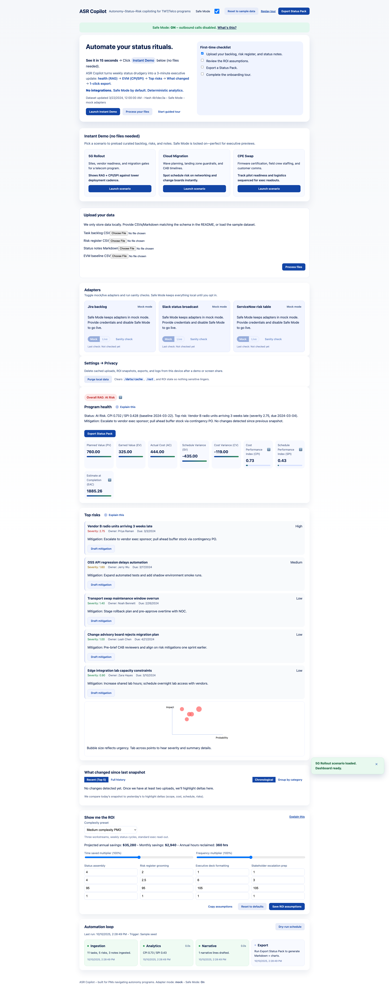
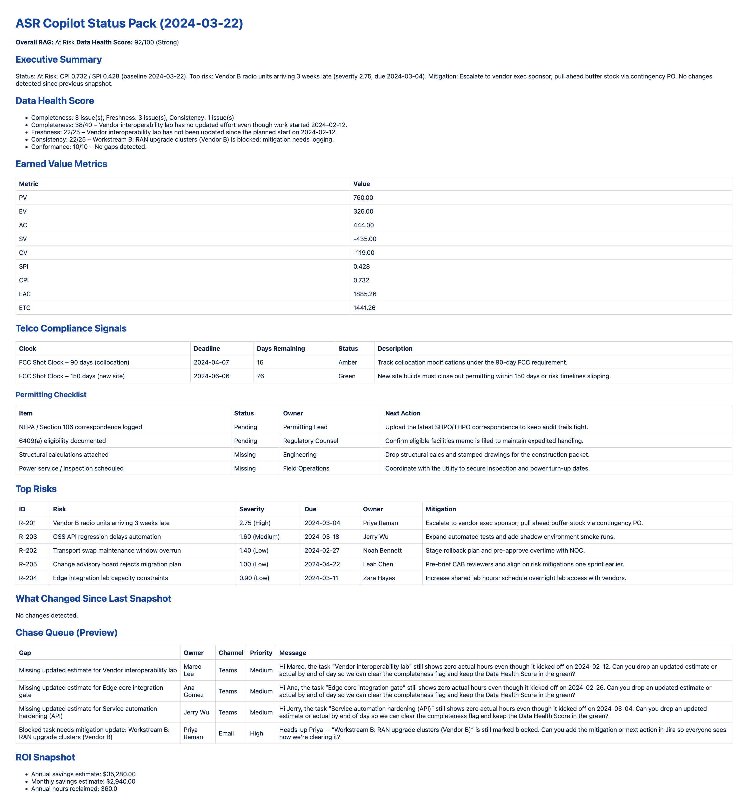

# ASR Copilot

[](#quickstart) [](https://github.com/codespaces/new?hide_repo_select=true&ref=main&repo=jlov7%2FASR-Copilot) [](LICENSE) 

ASR Copilot (Autonomy–Status–Risk Copilot) is a production-quality proof-of-concept that automates the most time-consuming, rationalizable PM workflows for enterprise TMT/Telco programs. It ingests CSV/Markdown status artifacts (no credentials required), computes earned value metrics, surfaces a live risk watchlist, narrates what changed since yesterday, and assembles a shareable executive status pack with a single click.

> **Why ASR Copilot**  
> Enterprise PMs spend **~3–4 hours/week** assembling status reports and chasing risk updates. ASR Copilot automates the boring parts—**without any integrations**—so leaders get consistent, auditable updates and PMs reclaim time.

| Before | After (ASR Copilot) | Impact example (tunable) |
| --- | --- | --- |
| Manual aggregation of spreadsheets, inconsistent narratives, risks discovered late (3–4 hrs/week/PM). | Upload CSV/MD → CPI/SPI gauges + risk deltas + “what changed” timeline → one-click executive status pack (minutes). | 30 PMs × 3.5 hrs/week × $120/hr × 48 wks ≈ **$604,800/yr**. A 70% reduction via ASR Copilot ≈ **$423,360/yr** reclaimed (adjust in the ROI panel). |

## Why it matters
Program managers in large enterprises spend 8–12 hours per week aggregating status, chasing risks, and preparing exec-ready updates. ASR Copilot shrinks that cycle to minutes by:
- Normalizing backlog, risk, and status-note inputs without integrations.
- Calculating CPI/SPI deltas and early schedule risk warnings.
- Auto-drafting executive narratives, mitigations, and ROI evidence to rationalize automation investments.

### Why agentic AI (safely) helps PMOs
1. **Automates drudgery, not decisions** – deterministic agents normalize inputs and pre-assemble evidence so PMs stay focused on steering calls.  
2. **Auditability first** – SPI = EV ÷ PV and CPI = EV ÷ AC; trusted control limits make rationalization defensible.  
3. **Guardrails on integrations** – Safe Mode is the default, adapters are read-only, logs redact secrets.  
4. **Real productivity gains** – enterprises see the biggest uplift when AI accelerates many workflows, not a single task.

## Key capabilities
- **No-integration mode**: Upload CSV/MD artifacts or load bundled samples instantly.
- **Executive cockpit**: RAG banner, EVM gauges, Top 5 risks, ROI estimator with complexity presets, and “what changed” timeline.
- **Status Pack exports**: Generates Markdown + PNG charts in `/out/` and optionally posts to Slack when credentials exist.
- **Adapters**: Mock Jira/Slack/ServiceNow providers ship by default; live adapters activate via `.env` tokens.
- **Safety-first**: Local-first storage, Safe Mode toggle to disable outbound calls, and deterministic summarization.

## See it in action





## Architecture snapshot
- **Backend**: FastAPI (Python 3.10+) with Pydantic contracts, modular `app/core` analytics (EVM, risks, diffs, summarizer), adapter layer, and status pack exporter.
- **Frontend**: Vite + React + TypeScript SPA with guided onboarding tour, skeleton loaders, accessible dashboard, and ROI configurator.
- **Data flow**: Ingested files parsed into structured JSON, validated, analyzed, and cached; frontend consumes typed endpoints.
- **Tooling**: pytest, ruff, black, eslint, prettier, husky-style git hooks via pre-commit.

## Quickstart

### Option A – Local toolchain
1. **Prerequisites**
   - Python 3.10+
   - Node.js 18+
   - `pip`, `npm`, and `uvicorn`
2. **Install backend dependencies**
   ```bash
   python3 -m venv .venv
   source .venv/bin/activate
   pip install -r requirements.txt
   ```
3. **Install frontend dependencies**
   ```bash
   cd app/frontend
   npm install
   ```
4. **Run the local demo**
   ```bash
   cd ..
   ./scripts/run_demo.sh
   ```
   The script boots FastAPI at `http://127.0.0.1:8000` and Vite at `http://127.0.0.1:5173`, preloads sample data, and opens the dashboard.

### Option B – Docker Compose (no local installs)
```bash
docker-compose up --build
```
Backend is available on `http://localhost:8000`, frontend on `http://localhost:5173`.

### Option C – GitHub Codespaces / Dev Containers
- Click the “Open in Codespaces” badge above or run `gh codespace create --repo jlov7/ASR-Copilot`.
- The devcontainer installs Python + Node dependencies automatically; use `./app/scripts/run_demo.sh` inside the Codespace.

## Vite + React rationale
- Granular control over accessibility and onboarding flows.
- Straightforward integration with FastAPI JSON contracts via generated TypeScript types.
- Supports progressive enhancements (tour, skeleton loaders) without heavy frameworks.

## Demo script (≈3 minutes)
1. Launch `./app/scripts/run_demo.sh` (ensures sample datasets copied, services started in Safe Mode).
2. In the browser landing page, click “Start the tour” to walk through five onboarding steps.
3. Use the “Load sample data” CTA to populate the dashboard.
4. Narrate the network modernization storyline: three workstreams (core backbone, RAN, OSS/BSS) and two vendors with intertwined dependencies.
5. Highlight the RAG banner showing CPI/SPI pressure from the RAN shipment slip; call out the late-delivery risk with its mitigation.
6. Review Top 5 risks and the dependency-heavy migration dry run chain using the timeline view.
7. Adjust ROI complexity presets (e.g., switch from Medium to High) and tweak sensitivity sliders to illustrate annual savings swings.
8. Click “Export Status Pack” to generate Markdown + PNG charts; confirm `/out/` gains `status_pack_<timestamp>.md`.
9. (Optional) Demonstrate Safe Mode toggle and explain live adapter enablement.

## Project layout (high level)
```
README.md
requirements.txt
app/
  backend/
  core/
  frontend/
  scripts/
  tests/
docs/
data/samples/
.tooling/
```
A detailed tree lives in `docs/ARCHITECTURE.md`.

### Documentation quick links
- [docs/PRD.md](docs/PRD.md) – problem statement, personas, acceptance criteria  
- [docs/PLAN.md](docs/PLAN.md) – milestones, risks, demo coordination  
- [docs/AGENTS.md](docs/AGENTS.md) – agent roles, triggers, and guardrails  
- [docs/DATA-SCHEMA.md](docs/DATA-SCHEMA.md) – CSV/Markdown contracts, EVM formulas, sample data dictionary  
- [docs/DEMOS.md](docs/DEMOS.md) – 3-minute & 10-minute demo walkthroughs  
- [docs/DEMO-DECK.md](docs/DEMO-DECK.md) – ready-to-present executive pitch deck (Markdown)  
- [docs/SECURITY.md](docs/SECURITY.md) – STRIDE-lite control set, Safe Mode posture  
- [docs/EVALS.md](docs/EVALS.md) – evaluation metrics, ROI scenario table, regression plan  
- [docs/CHANGELOG.md](docs/CHANGELOG.md) – release history & demo cues

## Environment configuration
- Copy `.env.example` to `.env` when enabling live adapters.
- Safe Mode (default) ensures zero outbound requests and relies on bundled mock adapters.
- Secrets are never stored or logged; redact tokens before sharing logs.
- For Jira live mode set `JIRA_BASE_URL`, `JIRA_USER_EMAIL`, `JIRA_TOKEN`, `JIRA_PROJECT_KEY`, and optionally `JIRA_JQL_FILTER`/`JIRA_MAX_RESULTS`; then disable Safe Mode to sync read-only backlog data.
- Run `pytest -m live` to execute Jira integration tests after supplying real credentials.

## Testing
- Run `pytest` for backend analytics and API regression coverage.
- `npm run test` executes frontend unit tests (Vitest) and accessibility smoke checks.
- Pre-commit hooks enforce formatting and linting prior to commits.

## API reference
- Swagger UI: `http://localhost:8000/docs`
- ReDoc: `http://localhost:8000/redoc`

## Accessibility & UX commitments
- WCAG AA color contrast, keyboard focus outlines, ARIA landmarks, and screen reader friendly chart summaries.
- Skeleton states for dashboard cards, empathetic empty states with direct CTAs, and graceful error banners with retry guidance.

## Contributing & next steps
- Read the [CONTRIBUTING guide](CONTRIBUTING.md) and [Code of Conduct](CODE_OF_CONDUCT.md) before opening a PR.
- Extend adapters under `app/backend/adapters` to integrate live Jira/Slack/ServiceNow endpoints.
- Expand evaluation metrics (latency, cost) using the scaffolding in `docs/EVALS.md`.
- Share feedback in the `docs/CHANGELOG.md` discussion log to inform the next sprint.
- File issues for Docker/Codespaces improvements or ecosystem adapters (e.g., ServiceNow change integration).
- Use the **Refresh Media Assets** workflow (Actions tab) if you tweak the UI and need new screenshots.

## License
Distributed under the [Apache 2.0 License](LICENSE). See the license file for details and the NOTICE requirements for derivative work.
